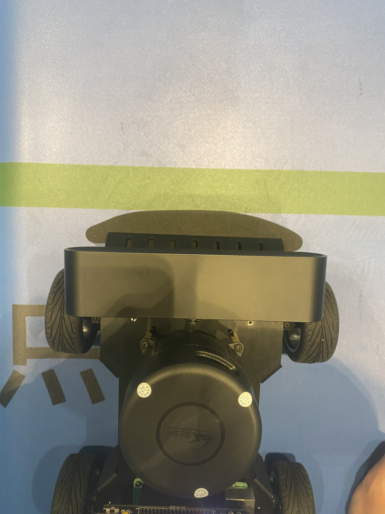
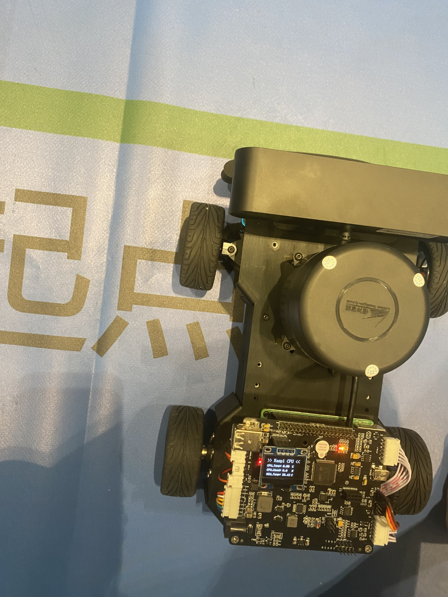

## 第二十五届中国机器人及人工智能大赛智慧药房组
ROS 破车的代码仓库
# 起点
* 发车点车辆摆放遵循以下的要求
  * 上边沿与绿色线条对齐

  * 左边沿与点的右竖杠对齐

# 常用命令
* 调参工具
rosrun rqt_reconfigure rqt_reconfigure
* 杀死所有节点 
rosnode kill -a
* 解决gazebo服务死亡的问题
killall gzserver
* ***导航_Ros主机（车）***
roslaunch robot_navigation robot_navigation.launch
* ***导航_Ros从机（PC）（将会打开Rviz）***
roslaunch robot_navigation navigation_rviz.launch
* 车不动调参
修改move_base.launch文件，将cmd_vel话题重命名（打开文件一看就懂）

# map参数
* 以114\*147pixel的fake_map（人为制作，不是slam建图）为基础，以左上角为(0,0)的原点右x正方向，下y正方向的图片坐标系
* 以114\*147pixel的fake_map按照5cm/像素转化为物理坐标系，那么生成570cm*735cm的物理扩大地图（左上为原点，xy与图片坐标系一致）
* 真实地图在扩大地图居中
* Ros栅格地图坐标系为x右y上
* 怎么算?[参考视频](https://www.bilibili.com/video/BV17W4y137pF/?spm_id_from=333.788&vd_source=16b1b0409d11ad21fe29562b0e9fc9b4)

|特殊点|图片坐标系|Ros坐标系|物理坐标系|
|:---:|:---:|:---:|:---:|
|Ros原点|(62.6,110.1)|(0,0)         |(3130,5505)|
| A点   |(72,59.5)   |(0.47,2.53)   |(3600,2975)|
| B点   |(90,49.5)   |(1.37,3.03)   |(4500,2475)|
| C点   |(90,69.5)   |(1.37,2.03)   |(4500,3475)|
| 1点   |(24,67.5)   |(-1.93,2.13)  |(1200,3375)|
| 2点   |(42,77.5)   |(-1.03,1.63)  |(2100,3875)|
| 3点   |(24,87.5)   |(-1.93,1.13)  |(1200,4375)|
| 4点   |(42.97.5)   |(-1.03,0.63)  |(2100,4875)|

